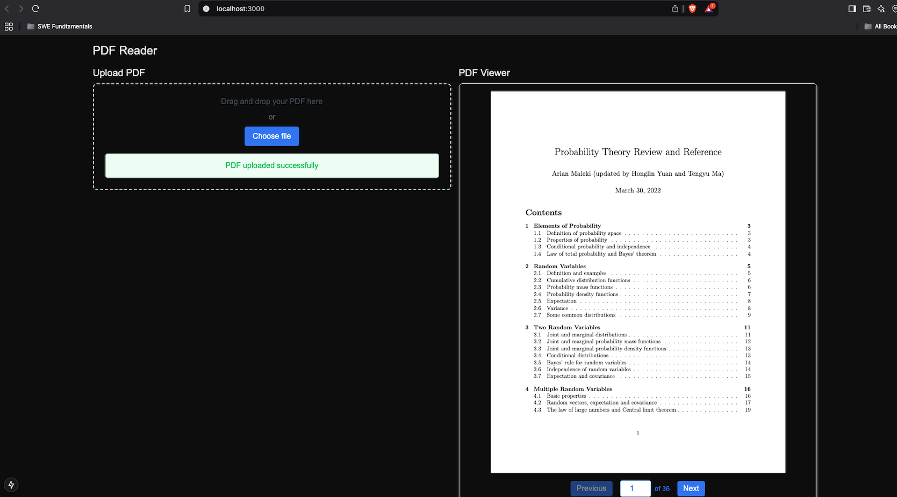

# PlayAI Product Engineering Test Project

## PDF Viewer Implementation

### Features
- PDF file upload and validation
- Real-time PDF rendering using PDF.js
- Page navigation:
  - Next/Previous page controls
  - Direct page jumping
  - Current page indicator
- Responsive design with Tailwind CSS
- Error handling and loading states

### Tech Stack
- PDF.js (CDN) for PDF rendering
- React for UI components
- Next.js for application framework
- Tailwind CSS for styling

## PlayAI Book Reader

- Build a user-friendly web application with file upload capabilities.
- Implement front-end logic for displaying PDF content and controlling audio playback.
- Bonus: integrate the PlayAI Agent API for conversational interaction.
- Demonstrate proficiency in full-stack development.

### Technical Requirements:

- PDF Upload: The user should be able to upload a PDF file through the web interface.
- Page Display: The uploaded PDF should be parsed and displayed on a per-page basis.
    - Users should be able to navigate between pages (e.g., using next/previous buttons or a page number input).
- Text-to-Speech: For each displayed page, the user should be able to initiate audio playback using the PlayAI Text-to-Speech API. The text-to-speech should play the content of the currently displayed page.
    - Provide controls (play/pause) for the audio playback.
- PlayAI Integration:
    - Use [PlayAI's Text-to-Speech API](https://docs.play.ai/tts-api-reference/endpoints/v1/tts/stream/post-playdialog) using HTTP or Websocket to read the content of the page.
- The application should use the API Key provided to make authenticated API calls.
    - API Key:
    - User ID:
- Select a PlayAI voice, you can use one of the agents from the provided list.

### (Bonus) Interactive Chat with the book:

Implement an optional voice chat interface that allows the user to ask questions about the currently displayed page. This chat should use [the PlayAI Agent API](https://docs.play.ai/api-reference/introduction), you [could use our web-embed widget for that](https://docs.play.ai/api-reference/web-embed) or build something custom using the websocket API.

---

### Functional Requirements:

**User Interface (UI):**

- The web app should have a clear and intuitive user interface.
- The UI should include components for uploading a PDF, displaying pages, playing audio, and the optional voice chat widget.
- The layout should be responsive for different screen sizes.

### **Evaluation Criteria:**

- Does the application meet the core requirements (PDF upload, page display, and audio playback)?
- Is the optional chat feature (if implemented) working correctly?
- Are there any bugs in the UI or functionality?
- Is there any attention to detail in the UI.
- How much time did it take to finish and deliver it?
- Is the code well-structured, readable, and maintainable?

---

**Bonus Points:**

- Implement the interactive voice chat interface.
- Implement a voice selection dropdown.
- Implement a progress indicator while generating the audio for the pages.
- Provide a UI to adjust the speed and temperature of the audio output.
- Implement any additional features that improve UX (Show your creativity).

**Deliverables:**

- A fully functional web application hosted on a server (you could use Replit).
- Source code for the application on github.
- A brief README file explaining how to run the app, what technologies were used, and a quick overview of the design decisions.
- Time Allotment: 8 hours — one aspect of evaluation is how fast are you in shipping product features.

**Additional Notes:**

You are free to choose any suitable full-stack technology (e.g., React, Vue.js with Node.js) but we prefer the NextJS, React, and Tailwind stack.

You can utilize any open-source libraries for PDF processing, UI components, etc.