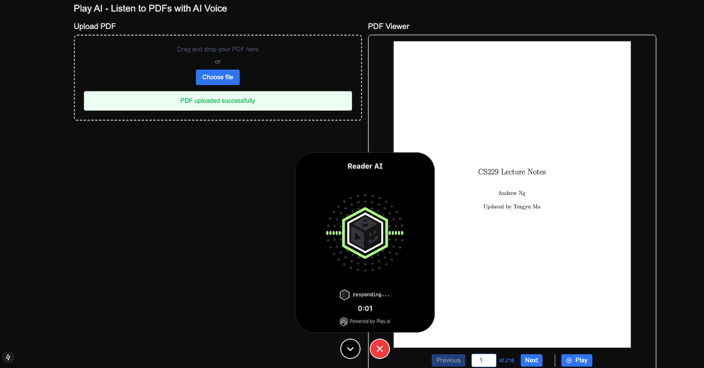

# PlayAI Book Reader

An interactive PDF reader with AI-powered text-to-speech and chat capabilities.

## Features

### Core Features
- PDF file upload and validation
- Real-time PDF rendering with page navigation
- Text-to-speech playback of PDF content
- AI-powered chat assistant for discussing PDF content
- Responsive design for all screen sizes

### PDF Viewer
- Upload and validate PDF files
- Navigate between pages (next/previous)
- Direct page number input
- Current page indicator
- Real-time page rendering

### Audio Controls
- Text-to-speech conversion of page content
- Play/Pause functionality
- Loading progress indicator
- Error handling with clear feedback

### AI Chat Assistant
- Initial state: Prompts user to upload PDF
- Post-upload: Enables discussion about current page
- Strict context adherence: Only discusses uploaded PDF content
- Safety feature: Returns to upload prompt if PDF is removed

## Tech Stack

### Frontend
- Next.js 14
- React
- Tailwind CSS
- PDF.js for PDF rendering
- Play AI Web SDK for chat integration

### Backend
- Express.js
- Play AI TTS API integration
- WebSocket support for real-time communication

### APIs
- Play AI Text-to-Speech API
- Play AI Agent API (Web Embed)

## Getting Started

### Prerequisites
- Node.js 18+
- npm or yarn
- Play AI API credentials

### Environment Setup
1. Clone the repository
2. Create `.env.local` in `frontend/`: `NEXT_PUBLIC_PLAY_AI_WEB_EMBED_ID="your_embed_id"`
2. Create `.env` in `backend/`: `PLAY_AI_API_KEY=your_api_key` and `PLAY_AI_USER_ID=your_user_id`